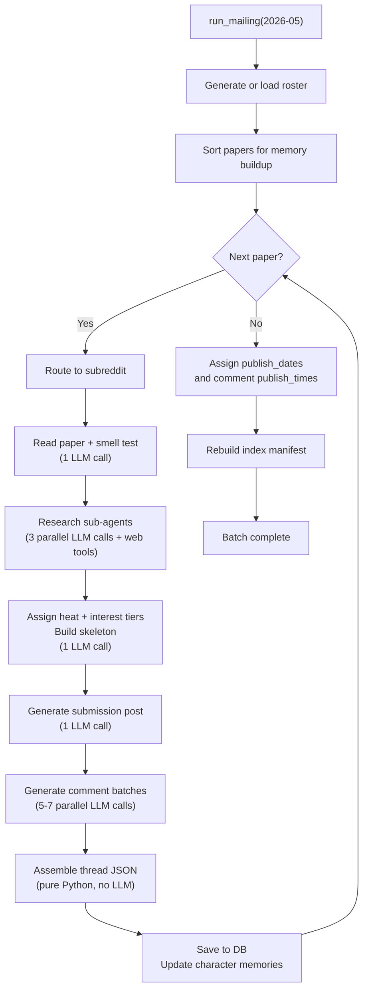
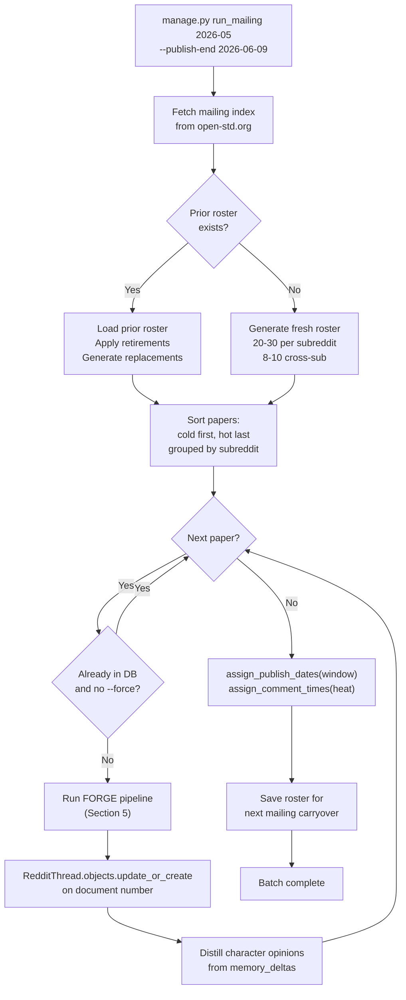

# Reddit Module Design

Architecture and execution machinery for generating fake subreddit threads that analyze WG21 papers.

- **Status:** Design document, no implementation
- **Depends on:** [FORGE Design Specification](forge-design.md), [reddit.md tool spec](../../private-context/tools/reddit.md)
- **Package:** `forge-reddit` (future addition to `packages/`)

---

## 1. Overview

The Reddit module ("The Mod") generates fake subreddit threads analyzing papers from WG21, the ISO C++ standards committee. Each thread reads like a real r/wg21 discussion: noise comments from drive-by readers, signal comments from domain experts, encounters where two knowledgeable users collide over a design tension, moderator actions, interstitial ads, and the full furniture of Reddit (votes, awards, edits, deleted posts, collapsed threads). The output is not satire. It is synthetic discourse calibrated to surface real technical observations about each paper, packaged in a format that is fun to read and structurally honest about how online communities actually process standards documents.

A typical WG21 mailing contains approximately 160 papers. The Reddit module processes the entire mailing in a single batch run. For each paper, a FORGE pipeline reads the paper, researches the landscape via parallel web-search sub-agents, assigns heat and interest tiers, composes a character cast, generates the thread in batches, and assembles the final JSON. The assembled thread JSON is stored in a Django `JSONField` on a `RedditThread` model. There is no static HTML generation at batch time. Django templates render threads server-side on request. Publication is drip-fed across the publication window (the gap between this mailing and the next): each thread carries a `publish_date` and each comment carries a `publish_time` (both absolute datetimes), and Django views filter by the current date and time so content appears progressively. Comment timestamps are never generated by the LLM; a pure-Python scheduling function assigns them after all threads are generated.

Two documents govern the system. The [reddit.md tool spec](../../private-context/tools/reddit.md) is the canonical creative reference: heat tiers, interest tiers, Tables A through D (voice, argumentation, domain, behavior), noise and signal generation paths, encounter rules, the ad palette, the mod roster, and all content rules. This design document governs execution machinery: pipeline decomposition, character roster management with persistent memory, batch scheduling, thread JSON schema, Django integration, and drip publication. The tool spec governs what the LLM produces. This document governs how and when.

---

## 2. Four Subreddits

The module routes each paper to one of four fake subreddits, each modeled on a real WG21 working group and its characteristic discussion culture.

### r/ewg

Evolution Working Group. Papers targeting EWG, study groups (SG1, SG7, SG9, SG12, SG14, SG21, SG22, SG23), and plenary direction papers. Medium baseline volume: 15-40 comments per thread depending on heat. Topics are language-level: new features, design direction, safety, reflection, pattern matching. Threads tend toward philosophical disagreement and competing design visions. Study group papers that address narrow domains (SG14 low-latency, SG7 compile-time) produce quieter threads within the medium range.

### r/lewg

Library Evolution Working Group. Highest volume subreddit. Papers targeting LEWG land here. Baseline: 20-60 comments. Libraries are visible to every C++ developer, opinions are cheap, and everybody has used `std::optional` wrong at least once. LEWG threads attract the widest range of commenters: application developers who care about API ergonomics, template metaprogramming enthusiasts who want everything `constexpr`, embedded developers who want to know the cost, and the inevitable "Boost already does this" commenter. This subreddit generates the most noise and the most traffic.

### r/cwg

Core Working Group. Quiet subreddit for wording papers and core language bug fixes. Baseline: 5-15 comments. Mostly technical, very little noise. The commenters who show up here actually read the proposed wording diffs. Threads are short, precise, and occasionally feature a single devastating observation about an interaction the paper missed. NB comment resolutions and defect reports dominate.

### r/lwg

Library Working Group. Quiet, similar to r/cwg but for library wording. Bug fixes, NB comment resolutions, LWG issue dispositions. Baseline: 5-15 comments. The signal-to-noise ratio is high because only people who care about library specification wording bother to comment.

### Routing

Papers are routed by the primary target audience listed in the paper's front matter. The first listed audience determines the subreddit:

- EWG, any SG, or Plenary as first audience: r/ewg
- LEWG as first audience: r/lewg
- CWG as first audience: r/cwg
- LWG as first audience: r/lwg

Papers targeting multiple audiences (e.g. "EWG, LEWG") go to the subreddit of the first listed audience. The routing is deterministic and requires no LLM call. Cross-subreddit characters (Section 3) provide connective tissue when a paper's implications span groups.

---

## 3. Character Roster

Each subreddit maintains a roster of 20-30 persistent characters. These are not regenerated per thread. They accumulate memory across threads within a mailing batch and carry over partially between mailings. Characters are the mechanism that makes threads feel like a living community rather than isolated comment sections.

### Character Composition

Each character is composed from the four tables defined in the [tool spec](../../private-context/tools/reddit.md):

- **Table A (Voice):** 12 registers from informal-precise to provocative-imperative
- **Table B (Argumentation):** 10 patterns from root-cause reframe to exhaustive-enumeration
- **Table C (Domain):** 13 domains from networking/async I/O to committee process
- **Table D (Behavior):** 8 patterns from posts-once-and-leaves to manifesto-writer

Additionally, each character has a **role** classification:

- **Signal:** long-path characters who produce substantive analysis. Composed from Tables A-D.
- **Noise:** short-path characters who produce quick reactions. Composed from the tone/stance palette in the tool spec Section 6. No Table B or Table C assignment.
- **Mod:** drawn from the fixed mod roster (6 usernames, defined in the tool spec).

### Character Dataclass

```python
@dataclass
class Character:
    username: str
    subreddit: str                      # primary subreddit assignment
    role: Literal["signal", "noise", "mod"]
    voice: int | None                   # Table A index (1-12), None for noise
    argumentation: int | None           # Table B index (1-10), None for noise
    domain: int | None                  # Table C index (1-13), None for noise
    behavior: int | None                # Table D index (1-8), None for noise
    tone: str | None                    # noise-only: sarcastic, confused, angry, etc.
    stance: str | None                  # noise-only: didn't-read, Rust-evangelist, etc.
    cross_subreddit: bool               # appears in multiple subreddits
    memory: deque[str]                  # rolling window, maxlen=20 sentences
    papers_seen: list[str]              # document numbers this character has commented on
    created_mailing: str                # mailing ID when character was created
    retired: bool                       # True if character is no longer active
```

### Memory Model

Each character maintains a rolling memory window of the last 20 opinion sentences. Every entry in the memory window is expressed as a first-person opinion - how the character feels about something they encountered. This is not a log of what the character said; it is a distillation of how the character reacted. Opinions are the highest-leverage format for steering future LLM output because they encode stance, intensity, and subject in a single sentence.

Examples of well-formed memory opinions:

- "I think P2900's contract semantics are under-specified and the committee is going to regret rushing this."
- "The async_scope proposal is the first sender/receiver paper that actually made me optimistic."
- "I'm tired of papers that bolt safety onto C++ without acknowledging the performance cost."
- "That argument about ABI stability was the weakest thing I've read this mailing."
- "I respect the ambition of reflection but the metaprogramming surface area terrifies me."

Examples of what memory entries must NOT be:

- Raw quotes from the character's comments (these drift toward voice mimicry without steering)
- Neutral factual summaries ("P2900 proposes contract annotations" - no opinion, no influence)
- Third-person descriptions ("The character thinks..." - breaks the first-person frame)

Memory serves three purposes:

1. **Voice consistency.** The LLM receives the character's recent opinions as context, ensuring the character sounds like the same person across threads. A character who was skeptical about sender/receiver in one thread stays skeptical in the next unless something in the paper specifically addresses their concern.
2. **Cross-reference.** Characters can reference positions they hold from earlier threads. "I mentioned this in the contracts thread, but the same problem applies here." These references are grounded in the opinion window, not hallucinated.
3. **Stance momentum.** Opinions carry forward a character's evolving perspective on recurring topics. A character who expressed frustration about ABI stability in paper N will bring that frustration into paper N+1 if ABI stability comes up again. The opinion format makes this automatic: the LLM reads "I'm frustrated that ABI keeps blocking progress" and naturally produces output consistent with that stance.

Memory accumulates during the serial paper loop (Section 4). After each paper's thread is generated, the pipeline distills each participating character's output into 1-3 opinion sentences and appends them to that character's memory window. The distillation is a lightweight LLM call: given the character's comments in the thread, produce opinion-form summaries of their reactions. The memory is a `collections.deque` with `maxlen=20`. Old opinions are evicted automatically as new ones are appended.

### Cross-Subreddit Characters

8-10 characters are flagged as `cross_subreddit=True`. These characters appear in threads across multiple subreddits. A cross-subreddit character with domain "concurrency/parallelism" might comment on an SG1 paper in r/ewg and a related LEWG paper in r/lewg, carrying memory between both appearances. Cross-subreddit characters are always signal-role. They provide the connective tissue that makes the four subreddits feel like overlapping communities rather than isolated silos.

### Roster Lifecycle Between Mailings

Between mailing batches, the roster evolves:

- **60-70% carry over with memory intact.** Most characters persist. Their composition (Tables A-D), username, and memory window all carry forward. A character who formed opinions about P2900R14 (contracts) in one mailing still holds those opinions when P2900R15 appears in the next mailing. This is essential for continuity: papers get revised, topics recur across mailings, and real community members don't get amnesia between months. The rolling `maxlen=20` window handles staleness naturally - old opinions are evicted as new ones accumulate, so a character's memory gradually shifts to reflect their most recent reactions.
- **`papers_seen` carries forward.** Characters remember which papers they have commented on in prior mailings. This enables cross-mailing references: "I said this about the R14 revision and I stand by it" or "They actually fixed the issue I flagged last time." The LLM receives `papers_seen` as context alongside the memory window.
- **Retirement.** Some characters are marked `retired=True` and stop appearing. Retirement is random within constraints: at least 2 characters from each Table C domain must survive, and all cross-subreddit characters survive unless replaced.
- **New arrivals.** New characters fill the gaps left by retirees. New characters have empty memory and no `papers_seen` history. They may reference being "new to this subreddit" in their first appearance.

The roster for a mailing is either generated fresh (first run) or loaded from the prior mailing's roster with retirement and replacement applied.

---

## 4. Execution Model

The Reddit module follows the canonical "serial envelope, parallel interior" pattern. Character memory is shared mutable state. Safe mutation requires that no two concurrent tasks read or write the same character's memory simultaneously. The design enforces this structurally: the serial envelope ensures memory is only mutated between parallel stages, and the parallel interior within a single paper never mutates memory.

### Serial Across Papers

The outer loop processes papers one at a time. This is mandatory because:

- Character memory from paper N informs character behavior in paper N+1. A character who just wrote a detailed analysis of a contracts paper carries that context into the next thread they appear in.
- Cross-subreddit characters must build coherent memory across threads. Parallelizing across papers would require locking or message-passing for shared character state, adding complexity without meaningful wall-clock improvement (the LLM API is the bottleneck, not local compute).

### Parallel Within a Paper

Within a single paper's pipeline, several stages run concurrently:

- **Research sub-agents** (3 parallel LLM calls with web search tools): public reception, committee history, author/ecosystem research
- **Comment batches** (5-7 parallel LLM calls): each batch generates 10-15 comments from a subset of the cast

These parallel stages use `asyncio.TaskGroup` for structured concurrency. If any task in a group fails, the group cancels remaining tasks and propagates the exception. No fire-and-forget.

### Concurrency Primitives

- `asyncio.TaskGroup` for fan-out parallelism within a paper
- `asyncio.Semaphore` for LLM API rate limiting (shared across all concurrent calls)
- Single process, single event loop. No Celery, no message broker, no distributed state.

The entire batch run is a single `async def run_mailing(mailing_id: str)` coroutine invoked via `asyncio.run()` from the Django management command.

### Flowchart



### Wall-Clock Estimates

- Per paper: ~20-30 seconds (dominated by LLM API latency, not local compute)
- Full mailing (~160 papers): ~1-2 hours
- The serial paper loop is the critical path. Within-paper parallelism reduces per-paper time from ~60-90 seconds (fully serial) to ~20-30 seconds.

---

## 5. Pipeline Per Paper

Each paper runs through a FORGE pipeline composed of approximately 5-10 LLM calls plus pure-Python assembly. The pipeline uses the FORGE orchestrator's public API.

### Usage

```python
from forge_orchestrator import Pipeline
from forge_schema import Step, RunResult
```

The Reddit module constructs a `Pipeline` programmatically using `Step` factories rather than compiling from prose. This is intentional: the pipeline structure varies per paper (comment batch count depends on heat/interest tiers, encounter presence depends on heat tier), so static compilation is not appropriate. The module builds the pipeline dynamically, then hands it to the FORGE orchestrator for execution.

### Pipeline Stages

**Stage 1: Collect (Read + Smell Test).** One LLM call. Reads the paper text and performs the two-pass analysis from the tool spec Section 1: surface extraction (hot takes, misconception traps, tangent magnets) followed by the smell test (load-bearing claims, tire-kicks, bullshit filter, falsification, framing audit). Returns: `technical_anchors`, `tangent_magnets`, `hot_takes`, `misconception_traps`, `paper_summary`, `paper_type`, `ad_keywords`. The `ad_keywords` field is a flat list of 5-15 short topic strings extracted from the paper's subject matter (e.g. `["coroutines", "async", "sender/receiver", "executors"]`). These are used at assembly time for semantic ad targeting (Section 7) and are not surfaced to the user.

**Stage 2: Research (3 Parallel Sub-Agents).** Three `llm` calls with `max_tool_calls > 0`, dispatched concurrently via `asyncio.TaskGroup`:

- **Public reception agent:** searches for the paper number, topic keywords, and author name. Returns: discussion volume, sentiment, competing proposals, heat signal.
- **Committee history agent:** searches for prior papers on the same subject, prior polls, contentious votes. Returns: topic longevity, close votes, controversy history, heat signal.
- **Author and ecosystem agent:** searches for the author's public profile, CppCon talks, ecosystem libraries, GitHub repos in the paper's problem space. Returns: name recognition, ecosystem presence, paper type signal, repo list, heat signal.

Each agent returns structured findings under 200 words plus a heat signal and interest signal. Total combined return: under 600 words.

**Stage 3: Tier Assignment + Skeleton (1 LLM Call).** Receives the smell test output and all three research returns. Assigns heat tier (cold/warm/hot/thermonuclear) and interest tier (niche/relevant/magnetic/gravitational) per the rules in the tool spec Sections 2.1-2.4. Builds the thread skeleton: total comment count, nesting map, which slots are noise/signal/encounter, which technical anchors each signal slot addresses, which carry quotes, which carry links. Returns: `heat`, `interest`, `skeleton` (list of comment slot descriptors), `encounter_plan` (or null).

**Stage 4: Submission Post (1 LLM Call).** Generates the submission post per tool spec Section 3. Receives paper metadata, paper summary, and heat/interest tiers. Returns: `poster` (username), `title`, `body`, `flair`, `link`, `votes`, `upvote_pct`.

**Stage 5: Comment Batches (5-7 Parallel LLM Calls).** The skeleton is partitioned into batches of 10-15 comment slots. Each batch receives: the skeleton partition, the assigned characters for those slots, each character's current memory window, the paper summary, relevant technical anchors, and the submission post for context. Each batch returns a flat list of generated comments with metadata (username, content, depth, score, timing offset, awards, edit text, flags).

Encounter batches are a special case. An encounter involves two characters in a multi-turn exchange where each turn references the prior turn. Encounter batches are internally serial (turns are generated sequentially within the batch call) but the batch itself runs in parallel with non-encounter comment batches. The LLM receives the encounter plan and generates turns sequentially within a single call.

**Stage 6: Assembly + Validation (Pure Python).** No LLM call. Python code assembles the flat comment lists from all batches into the recursive thread tree structure. Validation checks:

- Every technical anchor from the smell test appears in at least one comment
- Nesting depths respect the maximum (6)
- Vote distributions follow the tool spec patterns (sarcastic one-liners get high upvotes, best technical comment may be buried)
- Encounter turns are correctly threaded
- No duplicate usernames appear in the same comment chain (unless the character has Behavior D2 or D4)
- Comment timing offsets form a monotonically plausible sequence

Assembly also inserts interstitial ads by sampling from active `AdEntry` rows in the database (see Section 7), applies the furniture pass (edits, awards, daggers, collapsed comments, deleted posts), and handles mod actions per the tool spec Section 5b frequency rules. Ad insertion count depends on thread length: one ad per 15 top-level comments, minimum one per thread. Each ad is assigned a `position` equal to its insertion index in the full top-level comment list (e.g. position 15 for the first ad in a 45-comment thread, position 30 for the second). At render time, an ad is only shown once that many top-level comments are actually visible - so ads emerge naturally as the thread grows rather than appearing in a sparse thread. The selected ad's `name` and `copy` are baked directly into the thread JSON at generation time. At render time, the Django template reads ads from `thread_data` - no database lookup occurs. Deactivating or editing an `AdEntry` after generation has no effect on already-generated threads.

### LLM Never Produces the Full Thread

This is a critical design constraint. The LLM produces a flat skeleton and flat comment batches. Python assembles the tree. The reasons:

- A 150-comment thread with recursive nesting would be a single massive JSON blob that exceeds practical output token limits for most models.
- Flat batches are independently validatable. A malformed comment in batch 3 does not corrupt batches 1, 2, 4, 5, 6, and 7.
- Nesting logic is deterministic. The skeleton specifies parent-child relationships as slot references. Python builds the tree mechanically.

---

## 6. Thread JSON Schema

The thread JSON is the complete data model stored in the database. Django templates render it. Pydantic models define the structure.

### Models

```python
from datetime import datetime
from pydantic import BaseModel


class ThreadMeta(BaseModel):
    paper: str                          # base paper number, e.g. "P2900"
    revision: int                       # integer revision number
    document: str                       # full document number, e.g. "P2900R14"
    title: str                          # paper title
    authors: str                        # comma-separated author list
    audience: str                       # target audience from front matter
    date: str                           # paper date
    subreddit: str                      # one of: r/ewg, r/lewg, r/cwg, r/lwg
    heat: str                           # cold, warm, hot, thermonuclear
    interest: str                       # niche, relevant, magnetic, gravitational
    publish_date: str                   # ISO date for drip publication
    final_publish_time: str             # ISO datetime of the latest comment publish_time in this thread;
                                        # once now >= this value the thread is fully revealed and goes static
    generated_at: str                   # ISO datetime when thread was generated
    prior_revision: str | None = None   # document number of prior revision, if any


class Submission(BaseModel):
    poster: str                         # username without u/ prefix
    title: str                          # paper number + paper title
    body: str                           # markdown-formatted submission body
    link: str                           # URL to the paper
    flair: str                          # e.g. "WG21", "WG21 Update"
    votes: int                          # submission vote score
    upvote_pct: str                     # e.g. "87%"


class Comment(BaseModel):
    id: str                             # unique comment ID within the thread
    username: str                       # poster username
    content: str                        # markdown-formatted comment body
    depth: int                          # nesting depth, 0 = top-level
    parent_id: str | None = None        # parent comment ID, None for top-level
    score: int                          # vote score
    publish_time: str                   # ISO datetime for drip publication
    controversial: bool = False         # dagger marker
    awards: list[str] = []              # award emoji list
    edited: str | None = None           # edit text, e.g. "Edit: I misread section 3"
    collapsed: bool = False             # below-threshold collapse
    deleted: bool = False               # [deleted] marker
    removed: bool = False               # [removed by moderator] marker
    is_mod: bool = False                # green distinguished mod comment
    is_op: bool = False                 # original poster badge
    flair: str | None = None            # user flair text
    replies: list["Comment"] = []       # recursive child comments


class PromotedAd(BaseModel):
    advertiser: str                     # ad name, baked in at generation time
    copy: str                           # ad copy text, baked in at generation time
    position: int                       # render after this many top-level comments are visible;
                                        # ad is suppressed until the thread reaches this size


class MemoryDelta(BaseModel):
    username: str                       # character who produced output
    opinions: list[str]                 # first-person opinion sentences to append to memory


class Thread(BaseModel):
    meta: ThreadMeta
    submission: Submission
    comments: list[Comment]             # top-level comments (replies nested within)
    ads: list[PromotedAd]
    memory_deltas: list[MemoryDelta]    # used by batch runner to update character memories
```

### Example JSON (Abbreviated)

```json
{
  "meta": {
    "paper": "P2900",
    "revision": 14,
    "document": "P2900R14",
    "title": "Contracts for C++",
    "authors": "Joshua Berne, Timur Doumler, Andrzej Krzemienski",
    "audience": "CWG, EWG",
    "date": "2025-02-13",
    "subreddit": "r/cwg",
    "heat": "thermonuclear",
    "interest": "gravitational",
    "publish_date": "2026-05-08",
    "generated_at": "2026-05-01T14:23:07Z",
    "prior_revision": null
  },
  "submission": {
    "poster": "standards_watcher_2024",
    "title": "P2900R14 - Contracts for C++",
    "body": "Contracts are back. After the removal from C++20...",
    "link": "https://wg21.link/p2900r14",
    "flair": "WG21",
    "votes": 847,
    "upvote_pct": "87%"
  },
  "comments": [
    {
      "id": "c001",
      "username": "AutoModerator",
      "content": "**Paper metadata**\n\n- Document: P2900R14...",
      "depth": 0,
      "parent_id": null,
      "score": 1,
      "publish_time": "2026-05-08T08:00:00Z",
      "is_mod": true,
      "replies": []
    },
    {
      "id": "c002",
      "username": "daily_template_wizard_2019",
      "content": "great, another paper that will take 10 years to get through CWG",
      "depth": 0,
      "parent_id": null,
      "score": 234,
      "publish_time": "2026-05-08T08:12:00Z",
      "replies": [
        {
          "id": "c003",
          "username": "async_skeptic",
          "content": "> \"The contract predicate shall be...\"\n\nWait, does this mean...",
          "depth": 1,
          "parent_id": "c002",
          "score": 67,
          "publish_time": "2026-05-08T09:45:00Z",
          "replies": []
        }
      ]
    }
  ],
  "ads": [
    {
      "advertiser": "Compiler Explorer",
      "copy": "godbolt.org - because you need to see the assembly.",
      "position": 3
    }
  ],
  "memory_deltas": [
    {
      "username": "async_skeptic",
      "opinions": [
        "I think P2900's contract predicate evaluation sequencing is dangerously under-specified and nobody seems to notice.",
        "I'm suspicious that the abstract is underselling how disruptive this change actually is."
      ]
    }
  ]
}
```

---

## 7. Django Model

The thread JSON is stored as a single `JSONField` on a Django model. Scalar fields are pulled out for query filtering and indexing. Comments are not normalized into a separate table. The thread is a document, not a relational structure.

### Model Definition

```python
from django.db import models


class RedditThread(models.Model):
    document = models.CharField(
        max_length=20, unique=True,
        help_text="Full document number, e.g. P2900R14"
    )
    paper = models.CharField(
        max_length=10, db_index=True,
        help_text="Base paper number without revision, e.g. P2900"
    )
    subreddit = models.CharField(
        max_length=10, db_index=True,
        help_text="Target subreddit: r/ewg, r/lewg, r/cwg, r/lwg"
    )
    publish_date = models.DateField(
        db_index=True,
        help_text="Date the thread becomes visible on the index"
    )
    heat = models.CharField(
        max_length=15,
        help_text="Heat tier: cold, warm, hot, thermonuclear"
    )
    interest = models.CharField(
        max_length=15,
        help_text="Interest tier: niche, relevant, magnetic, gravitational"
    )
    final_publish_time = models.DateTimeField(
        db_index=True,
        help_text="Datetime of the latest comment in the thread. "
                  "Once now >= this value the thread is fully revealed and the view switches to a long TTL."
    )
    thread_data = models.JSONField(
        help_text="Complete Thread JSON (meta, submission, comments, ads)"
    )
    generated_at = models.DateTimeField(
        auto_now_add=True,
        help_text="Timestamp when the thread was generated"
    )

    class Meta:
        indexes = [
            models.Index(fields=["subreddit", "publish_date"]),
            models.Index(fields=["paper"]),
        ]

    def __str__(self):
        return self.document
```

### Design Rationale

**Why JSONField, not normalized tables.** A thread is read as a unit. The Django template walks the comment tree to render it. Normalizing comments into a `RedditComment` table with foreign keys would require recursive queries or materialized path lookups on every page load, adding latency and complexity without benefit. The only queries against thread data are:

- Index page: filter by `publish_date` and `subreddit`, order by `publish_date` descending. These hit scalar indexed fields, not the JSON.
- Comment visibility within a thread: filtered in Python/template logic by comparing `publish_time` against the current time. This walks the in-memory comment tree after the single `thread_data` JSON is loaded.

**Why scalar fields alongside JSONField.** The `document`, `paper`, `subreddit`, `publish_date`, `final_publish_time`, `heat`, and `interest` fields are duplicated from `thread_data.meta` into scalar columns specifically for efficient querying. Django's `JSONField` lookups (`thread_data__meta__heat="thermonuclear"`) work but do not use indexes on PostgreSQL without `GIN` index configuration. Scalar fields with standard B-tree indexes are simpler and faster for the access patterns this application needs.

---

## 8. Drip Publication

All threads for a mailing are generated in one batch. No content is generated incrementally. Instead, each thread and each comment carries an absolute datetime that governs when it becomes visible. Django views filter by these timestamps, creating the illusion of progressive, organic activity across the publication window.

### Publication Window

The batch runner receives a date range: the mailing date (start of the publication window) and the next mailing date (end of the publication window). All threads and all comments must have their timestamps distributed within this window.

Example: if the mailing drops on April 20 and the next mailing drops on May 10, the publication window is April 20 through May 9 (the day before the next mailing). Every thread's `publish_date` and every comment's `publish_time` must fall within this range.

The window is a required input, not a hardcoded "30 days." Mailing cadence varies (pre-meeting mailings drop closer together, summer mailings have wider gaps). The scheduling function adapts to whatever window it receives.

### Two Timestamps, Two Granularities

- **`publish_date`** (on ThreadMeta, mirrored to `RedditThread.publish_date`): the date the thread appears on the subreddit index. Granularity: date. Used by the index view to decide which threads are listed.
- **`publish_time`** (on each Comment): the datetime the comment becomes visible within its thread. Granularity: datetime with minute precision. Used by the thread view to decide which comments are rendered.

### LLM Does Not Assign Timestamps

This is a critical design constraint. The LLM generates comments with no timing information. The `publish_time` field on every comment is left blank (null) during pipeline generation. A pure-Python scheduling function assigns all timestamps after generation is complete. The reasons:

- LLMs hallucinate numbers. Asking an LLM to produce plausible ISO datetimes distributed over a multi-day window is unreliable and wasteful of prompt tokens.
- Timestamp assignment requires global knowledge of all threads in the mailing, their heat/interest tiers, and the publication window boundaries. No single per-paper LLM call has this context.
- Distribution logic is deterministic and formulaic. Python does this better, faster, and without error.

The LLM's only timing-relevant output is the comment's structural position in the thread (depth, parent_id, slot index from the skeleton). The scheduling function uses structural position plus heat tier to compute timestamps.

### Thread Spacing Across the Window

The `assign_publish_dates()` function distributes threads across the publication window according to these rules:

- Threads are spread evenly across available days in the window. No single day should be overloaded while other days are empty.
- Hot and thermonuclear papers are spaced across the window. No two thermonuclear papers publish on the same day. Hot papers have at least one day between them.
- Gravitational-interest papers are tentpole events, approximately one per week. They anchor the publication calendar.
- Cold and niche papers fill the gaps as weekday filler.
- Fewer posts on weekends. Saturday and Sunday get at most 1-2 cold threads each. Hot and thermonuclear papers never publish on weekends.

### Reply Duration by Heat Tier

Each thread has a reply duration that determines how long comments play out after the thread's `publish_date`. The duration depends on the thread's heat tier:

- **Cold/warm:** 1 day. All comments appear within 24 hours of the thread's publication. Low-stakes threads burn fast and go quiet.
- **Hot:** 2 days. Comments are distributed across 48 hours. The thread stays active longer, reflecting sustained interest.
- **Thermonuclear:** 3 days. Comments play out over 72 hours. The thread dominates the subreddit for days, with new signal comments, encounter turns, and late arrivals appearing well after the initial burst.

### Comment Timestamp Assignment

The `assign_comment_times()` function walks each thread's comment tree and assigns `publish_time` values. It uses structural position and role to create a realistic progression within the reply duration window:

- **AutoModerator pins:** Immediate. Same datetime as the thread's `publish_date` + a few seconds.
- **Noise comments:** Early. Distributed across the first 10-20% of the reply duration. Drive-by reactions appear fast.
- **Signal comments:** Middle. Distributed across 20-70% of the reply duration. These commenters read the paper before responding.
- **Encounter turns:** Sequential within the middle-to-late range. The first turn appears at 30-50% of the reply duration. Subsequent turns are spaced proportionally (each turn is a fixed fraction of the remaining duration apart). The encounter plays out as a real-time back-and-forth.
- **Late arrivals:** Last 30% of the reply duration. The "actually, I just read this more carefully" comments.
- **Mod actions:** Timed relative to the comment they act on. A removal appears 1-3 hours after the offending comment's `publish_time`.

Within each band, comments are distributed with small random jitter to avoid mechanical regularity. The function is deterministic given a seed (derived from the mailing ID and document number) so re-runs produce identical timestamps. After assigning all comment times, the function records the maximum `publish_time` across the entire comment tree as `ThreadMeta.final_publish_time` and mirrors it to the `RedditThread.final_publish_time` scalar column. This is the value the view uses to determine cache TTL (Section 8, Caching).

### Index View Filtering

```python
def subreddit_index(request, subreddit):
    threads = RedditThread.objects.filter(
        subreddit=subreddit,
        publish_date__lte=date.today(),
    ).order_by("-publish_date")
    # ...
```

A thread that has `publish_date=2026-05-15` is invisible on the index before May 15 and visible from May 15 onward. The index card shows the submission title, poster, vote count, and the current visible comment count (computed at render time by counting comments whose `publish_time` is in the past).

### Thread View Filtering

Within a thread, the template iterates the comment tree and renders only comments whose `publish_time` is at or before the current moment:

```python
def thread_detail(request, document):
    thread = get_object_or_404(RedditThread, document=document)
    now = timezone.now()
    # Template receives thread_data and now; filtering happens in template/templatetag
    # ...
```

A template tag or filter recursively walks the comment tree and suppresses comments (and their entire reply subtree) whose `publish_time` is in the future. A thermonuclear thread published on Monday may show 20 of its eventual 80 comments on Monday evening, 50 by Tuesday night, and the full set by Thursday morning.

**Ad visibility rule.** After filtering the visible top-level comments, the template inserts each `PromotedAd` only if the number of currently visible top-level comments is at least `ad.position`. An ad with `position=5` is invisible until at least five top-level comments are present; once that threshold is crossed, the ad is inserted after the fifth comment in the visible list. This means ads appear naturally as the thread grows rather than floating in an otherwise empty thread. No timestamp is needed on the ad itself - the comment drip schedule implicitly controls when the thread reaches each size threshold.

### Caching

Thread pages use a two-phase TTL keyed on `RedditThread.final_publish_time`:

- **Active phase** (`now < final_publish_time`): the thread still has unrevealed comments. Cache TTL is **1 hour**. On each cache miss the view re-renders with the latest visible set of comments.
- **Static phase** (`now >= final_publish_time`): all comments are visible and the page will never change again. Cache TTL is **1 day**. The page can be served from cache for 24 hours before a re-render, which is acceptable because all displayed timestamps are relative (see below).

The view computes the appropriate TTL and sets it via the `Cache-Control: max-age` response header. No external cache invalidation event is needed - the phase transition is self-managing based on the current time.

```python
def thread_detail(request, document):
    thread = get_object_or_404(RedditThread, document=document)
    now = timezone.now()
    ttl = 3600 if now < thread.final_publish_time else 86400
    response = render(request, "reddit/thread.html", {"thread": thread, "now": now})
    response["Cache-Control"] = f"public, max-age={ttl}"
    return response
```

### Relative Timestamps

All timestamps displayed in body content on thread pages and index cards use Django's `naturaltime` template filter (from `django.contrib.humanize`). `naturaltime` renders ISO datetimes as "3 minutes ago", "2 hours ago", "4 days ago", and so on. Absolute datetimes are permitted only as a CSS `title` attribute on the relative timestamp element, which surfaces the absolute time as a browser-native hover tooltip without any JavaScript. This is the only context in which an absolute datetime appears on the page.

This is what makes the 1-day static TTL safe: once a thread has crossed into the static phase, every comment is at least 1-3 days old (the reply duration has fully elapsed). A cached page that is up to 24 hours stale will show "3 days ago" instead of "4 days ago" for the oldest comments - a difference imperceptible to readers. During the active phase the 1-hour TTL keeps relative times accurate to within an hour, which is similarly fine for display.

### No Client-Side Rendering

The thread page contains no client-side rendering logic. Comment visibility filtering, relative timestamp formatting, ad insertion, and cache TTL selection all execute server-side at request time. The hover-tooltip absolute datetime is supplied at render time as a static HTML attribute. Two consequences follow: every reader hitting the same URL within the same TTL window receives byte-identical HTML, which makes the page trivially cacheable at the CDN edge; and the page degrades gracefully under JavaScript-disabled, screen-reader, and search-engine-crawler conditions without special handling.

### Comment Count on Index Cards

The index card for each thread shows a comment count. Because comments appear progressively, this count increases over the reply duration (1-3 days depending on heat). The template computes it dynamically at render time by counting visible comments (those with `publish_time <= now`). No counter column needs updating.

---

## 9. Processing Order

Papers are sorted before the serial generation loop to optimize character memory buildup. Processing order is independent of publication order: a cold paper processed first may be published on any date, and a thermonuclear paper processed last may be published on day one. The sorting is purely about character voice quality.

### Sort Key: Cold First, Hot Last

1. **Cold/niche papers first.** Low-stakes threads where characters warm up. Memory windows start empty, so early threads have less voice consistency. Cold papers tolerate this because they have fewer signal comments and no encounters. Characters build initial voice patterns without the stakes being high.
2. **Warm papers in the middle.** Characters have established some voice patterns. Warm papers have 2-4 signal comments and occasional encounters, which benefit from characters having prior output in their memory windows.
3. **Hot and thermonuclear papers last.** These threads demand the strongest character voice consistency because they have the most signal comments, deepest encounters, and the most cross-reference opportunities. By the time the batch reaches thermonuclear papers, every active character has 15-20 sentences in their memory window from prior threads.

### Subreddit Grouping Within Heat Tiers

Within each heat tier, papers are grouped by target subreddit. This ensures that cross-subreddit characters build coherent memory within one subreddit before switching to another:

```
cold/r/cwg, cold/r/cwg, cold/r/lwg, cold/r/ewg, cold/r/lewg, ...
warm/r/cwg, warm/r/lewg, warm/r/ewg, ...
hot/r/lewg, hot/r/ewg, ...
thermonuclear/r/lewg, thermonuclear/r/ewg, ...
```

A cross-subreddit character with domain "concurrency" who comments on three r/ewg papers in sequence builds a coherent r/ewg voice before appearing in an r/lewg thread. Without this grouping, the character would context-switch between subreddits on every paper, producing less coherent memory.

### Scheduling Independence

The `assign_publish_dates()` function runs after the generation loop completes (Section 10). It reads the generated threads' heat and interest tiers to assign publication dates. It does not consider processing order. A cold paper processed first might be published on day 18 as weekday filler, while a thermonuclear paper processed last might be published on day 3 as the first tentpole.

---

## 10. Batch Runner

The batch runner is a Django management command that orchestrates the entire mailing batch: roster management, paper sorting, serial pipeline execution, database persistence, and publication scheduling.

### Command Interface

```
python manage.py run_mailing 2026-05 --publish-end 2026-06-09 [options]

Arguments:
  MAILING_ID        Mailing identifier, e.g. "2026-05". Also used as the
                    publication window start date (first day of the month).

Options:
  --publish-end     End of publication window (ISO date). Required. Typically
                    the day before the next mailing drops. All thread and
                    comment timestamps will fall before this date.
  --publish-start   Override the start of publication window (ISO date).
                    Defaults to the mailing date if not specified.
  --force           Regenerate threads even if they already exist
  --papers P1,P2    Process only the listed document numbers
  --dry-run         Run pipelines but do not save to DB
  --roster FILE     Load roster from a JSON file instead of generating
```

### Execution Sequence



### Idempotency

The batch runner uses `RedditThread.objects.update_or_create(defaults=..., document=doc_number)` to persist each thread. Running the same mailing twice without `--force` skips papers that already have a `RedditThread` row. Running with `--force` regenerates and overwrites. This makes the command safe to re-run after partial failures: completed threads are preserved, failed threads are retried.

### Roster Persistence

The roster (list of `Character` dataclass instances) is serialized to JSON and stored alongside the mailing's data. The storage location is the same `RedditThread` model's database, in a separate model:

```python
class CharacterRoster(models.Model):
    mailing = models.CharField(max_length=10, unique=True)  # e.g. "2026-05"
    roster_data = models.JSONField()                         # serialized Character list
    created_at = models.DateTimeField(auto_now_add=True)
```

On the next mailing run, the batch runner loads the prior mailing's roster, applies retirement logic (Section 3), generates replacements, and saves the new roster.

### Ad Entry Model

Interstitial ads are stored in a database table. New ads can be added or toggled without touching the tool spec or regenerating threads.

```python
class AdEntry(models.Model):
    name = models.CharField(
        max_length=100,
        help_text="Advertiser name, e.g. 'Compiler Explorer'"
    )
    copy = models.TextField(
        help_text="Ad copy text rendered inline in the thread, markdown allowed"
    )
    active = models.BooleanField(
        default=True, db_index=True,
        help_text="Only active ads are sampled during thread generation"
    )
    subreddit_affinity = models.CharField(
        max_length=20, blank=True, default="",
        help_text="Optional subreddit hint (r/ewg, r/lewg, r/cwg, r/lwg). "
                  "Empty means eligible for all subreddits."
    )
    weight = models.PositiveSmallIntegerField(
        default=10,
        help_text="Relative sampling weight. Higher values appear more often."
    )
    keywords = models.JSONField(
        default=list, blank=True,
        help_text="List of keyword strings used for semantic ad targeting. "
                  "Empty list means the ad is eligible for any thread regardless of topic."
    )
    created_at = models.DateTimeField(auto_now_add=True)
    updated_at = models.DateTimeField(auto_now=True)

    class Meta:
        verbose_name = "Ad Entry"
        verbose_name_plural = "Ad Entries"

    def __str__(self):
        return self.name
```

**Sampling.** The assembly stage calls `AdEntry.objects.filter(active=True)`, then narrows to rows whose `subreddit_affinity` is blank or matches the thread's subreddit. It performs a weighted random draw (using `weight` values) to select the ads to insert. Weights are normalized at draw time - no need to keep them summing to any fixed total.

**Seeding.** The 30-entry ad palette from the tool spec is the initial seed dataset, loaded via a Django data migration. Subsequent additions go through the Django admin. The tool spec remains the authoritative creative reference for what ads look like; the database is the authoritative list of which ads are currently active.

**Baked-in ads.** When an ad is selected, its `name` and `copy` are written into the `PromotedAd` entries in the thread JSON. Ads are frozen at generation time. The Django template reads them from `thread_data.ads` - it never queries `AdEntry` at render time. Deactivating or editing an `AdEntry` row after generation does not affect any thread that has already been stored.

**Keyword targeting (planned).** Each `AdEntry` carries a `keywords` list. Each paper's Stage 1 pipeline call (Collect) extracts a topic keyword list from the paper text and returns it alongside `technical_anchors` and `paper_summary`. At assembly time, the ad sampling step scores each active `AdEntry` against the thread's keywords and biases the weighted draw toward ads with higher relevance. The intended matching approach is semantic embedding similarity: embed the thread keyword list and each ad's keyword list into a shared vector space, compute cosine similarity, and multiply the similarity score by the ad's `weight` to produce a final sampling weight. Ads with empty `keywords` are treated as universally eligible and receive their base `weight` unmodified. Ads with keywords that score below a minimum similarity threshold against the thread are not excluded but are downweighted - they can still appear, just less often. This preserves some variety and avoids over-targeting. The embedding model and similarity threshold are configurable constants, not hardcoded. The fallback when no embedding model is available is plain keyword overlap (intersection count divided by union count), which requires no external dependency and produces reasonable results for technical vocabulary.

### Post-Generation Scheduling

After all threads are generated, two pure-Python functions run in sequence:

1. **`assign_publish_dates(window_start, window_end)`** reads every `RedditThread` for the mailing and distributes `publish_date` values across the publication window according to the rules in Section 8. It needs the full set of threads and their heat/interest distributions to make spacing decisions. A thermonuclear paper cannot be spaced appropriately without knowing how many other thermonuclear papers exist in the same mailing.

2. **`assign_comment_times()`** iterates each thread's comment tree and assigns absolute `publish_time` values. It uses the thread's `publish_date` as the anchor and distributes comments across the reply duration (1 day for cold/warm, 2 days for hot, 3 days for thermonuclear) according to the rules in Section 8.

Both functions are deterministic given the mailing ID. The updated threads are saved back to the database in a single bulk update.

### Index Rebuild

After scheduling, the batch runner rebuilds a manifest (JSON file or model row) listing all published threads, their subreddit assignments, and their publication dates. This manifest is the data source for the Django index views. The index is rebuilt from scratch each time, never incrementally patched.

---

## 11. Relationship to reddit.md Tool Spec

The [reddit.md tool spec](../../private-context/tools/reddit.md) and this design document are complementary. Neither is complete without the other. Their responsibilities are cleanly separated.

### What reddit.md Governs (Creative Output)

The tool spec is the canonical reference for everything the LLM needs to produce quality output:

- **Heat tiers** (Section 2.3): cold, warm, hot, thermonuclear. Comment count baselines, encounter frequencies, mod action frequencies.
- **Interest tiers** (Section 2.4): niche, relevant, magnetic, gravitational. Comment count multipliers, thread depth, link density, domain coverage requirements.
- **Table A (Voice):** 12 voice registers from informal-precise to provocative-imperative.
- **Table B (Argumentation):** 10 argumentation patterns from root-cause reframe to exhaustive-enumeration.
- **Table C (Domain):** 13 domain lenses from networking/async I/O to committee process.
- **Table D (Behavior):** 8 behavioral patterns from posts-once-and-leaves to manifesto-writer.
- **Noise generation path** (Section 6): tone palette, stance palette, stock phrases.
- **Signal generation path** (Section 7): the four-table composition system.
- **Encounter rules** (Section 11): trigger conditions, frequency by heat tier, shape constraints, nesting depth.
- **Content rules** (Section 10): paper quotes, anchor-to-findings mandate, code in comments, tangent threads, spam, update-thread archetypes.
- **Ad palette (seed data):** 30 fake Reddit "Promoted" posts for C++ ecosystem products. These are the initial seed rows for the `AdEntry` table. After seeding, the database is the live source of truth; the tool spec is the creative reference only.
- **Mod roster:** 6 fixed moderator usernames with role descriptions.
- **CSS and HTML structure** (Sections 12-16): thread and index page rendering.

These are prompt material. They are injected into LLM calls as context, not implemented as code.

### What This Design Document Governs (Execution Machinery)

This document specifies everything outside the LLM's responsibility:

- **Pipeline decomposition** (Section 5): which LLM calls happen, in what order, what each receives and returns, which run in parallel.
- **Character roster management** (Section 3): the `Character` dataclass, rolling memory windows, cross-subreddit assignment, retirement and replacement between mailings.
- **Thread JSON schema** (Section 6): Pydantic models that define the exact structure of stored thread data. The LLM produces fragments. Python assembles them into this schema.
- **Django model** (Section 7): the `RedditThread` model, scalar indexes, JSONField storage; the `AdEntry` model with weighted sampling and subreddit affinity.
- **Drip publication** (Section 8): two-timestamp system, index view filtering, thread view filtering, comment count progression.
- **Processing order** (Section 9): cold-first sort for memory buildup, subreddit grouping.
- **Batch runner** (Section 10): the management command, idempotency via `update_or_create`, roster persistence, post-generation scheduling.
- **Execution model** (Section 4): serial envelope for memory safety, parallel interior for throughput, asyncio.TaskGroup, no Celery.

### Integration Points

The tool spec and this design document meet at two interfaces:

1. **LLM prompt assembly.** The FORGE pipeline (Section 5) injects tool spec content (tables, rules, examples) into LLM call prompts. The pipeline structure (which calls, in what order) is defined here. The prompt content (what the LLM reads) comes from the tool spec.
2. **Thread JSON output.** The LLM produces comment text, usernames, scores, and timing offsets. Python assembles these into the `Thread` Pydantic model (Section 6). The tool spec governs what the LLM puts in each field (voice register, argumentation pattern, technical anchors). This document governs the field names, types, nesting structure, and storage format.

---

## License

Boost Software License 1.0
